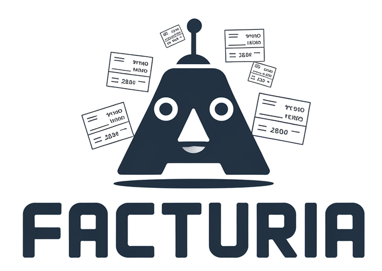

# FacturIA - Sistema de Automatización de Facturas con IA



## Descripción

FacturIA es un sistema automatizado diseñado para procesar facturas en formato PDF (texto o imagen), extraer su información utilizando modelos de Inteligencia Artificial (Google Gemini Vision), almacenar los datos en una base de datos SQLite, y visualizarlos mediante un dashboard interactivo en Power BI.

Este proyecto integra tecnologías de análisis de datos modernas para optimizar la gestión documental y facilitar el análisis financiero, con soporte completo para facturas escaneadas o fotografiadas.

## Características Principales

- **Extracción Automática de Datos**: Utiliza Google Gemini Vision para extraer información estructurada de facturas en PDF, tanto texto como imágenes
- **Soporte para Imágenes**: Procesa facturas escaneadas, fotografías y capturas de pantalla usando IA de visión
- **100% Gratuito**: Usa Google Gemini API sin costos
- **Almacenamiento en Base de Datos**: Guarda los datos procesados en SQLite para consultas eficientes
- **Dashboard Interactivo**: Visualización profesional en Power BI con KPIs y análisis detallados
- **Conversión de Divisas**: Conversión automática de dólares a euros
- **Procesamiento por Lotes**: Capacidad de procesar múltiples facturas organizadas por carpetas
- **Detección Inteligente**: Identifica automáticamente si el PDF es texto o imagen y aplica el método apropiado

## Tecnologías Utilizadas

- **Python 3.x**
  - `pandas`: Manipulación y análisis de datos
  - `PyMuPDF (fitz)`: Extracción de texto e imágenes de archivos PDF
  - `google-generativeai`: Integración con Google Gemini Vision API (gratuita)
  - `Pillow (PIL)`: Procesamiento de imágenes
  - `sqlalchemy`: Gestión de base de datos SQLite
  - `python-dotenv`: Manejo seguro de variables de entorno

- **Google Gemini Vision**: IA multimodal para lectura de facturas en texto e imagen

- **Power BI**: Visualización de datos y creación de dashboards interactivos

- **SQLite**: Base de datos ligera para almacenamiento local

## Estructura del Proyecto

```
FacturIA/
├── main.py                          # Script principal de ejecución
├── funciones.py                     # Funciones auxiliares de procesamiento
├── prompt.py                        # Prompt optimizado para OpenAI
├── entorno.yml                      # Dependencias del entorno conda
├── .env                             # Variables de entorno (API keys)
├── Dashboard_FacturIA.pbix          # Dashboard de Power BI
├── Logo_FacturIA.png                # Logo del proyecto
├── IMPORTANTE - LEER.txt            # Instrucciones importantes
└── iconos/                          # Iconos utilizados en el dashboard
    ├── companias.png
    ├── euro.png
    ├── evolucion.png
    ├── facturas.png
    ├── gasto_por_factura.png
    └── proveedores.png
```

## Instalación

### 1. Clonar el repositorio

```bash
git clone https://github.com/silvanopuccini/SilvanoPucciniTheAnalyst.github.io.git
cd SilvanoPucciniTheAnalyst.github.io/proyectos/FacturIA
```

### 2. Instalar dependencias

```bash
# Opción 1: Usar pip con requirements.txt
pip install -r requirements.txt

# Opción 2: Instalar manualmente
pip install pandas pymupdf google-generativeai Pillow sqlalchemy python-dotenv

# Opción 3: Con conda
conda env create -f entorno.yml
conda activate facturia
```

### 3. Configurar API Key de Google Gemini

1. Obtén tu API key gratuita en: https://aistudio.google.com/app/apikey
2. Crea un archivo `.env` en la carpeta del proyecto:

```
GEMINI_API_KEY=tu_api_key_de_google_gemini_aqui
```

**IMPORTANTE**: Nunca compartas tu API key públicamente

## Uso

### 1. Preparar tus facturas

Crea una carpeta `facturas/` y organiza tus PDFs por subcarpetas (ej: por mes o año):

```
facturas/
├── enero/
│   ├── factura1.pdf          # PDF con texto
│   ├── factura_escaneada.pdf # PDF escaneado (imagen)
│   └── foto_factura.pdf      # Foto de WhatsApp convertida a PDF
└── febrero/
    └── factura3.pdf
```

**FacturIA acepta:**
- PDFs con texto seleccionable
- PDFs escaneados (imágenes)
- Fotos de facturas (convertidas a PDF)
- Capturas de pantalla de facturas

### 2. Ejecutar el procesamiento

```bash
python main.py
```

El script:
1. Detecta automáticamente si cada PDF es texto o imagen
2. Usa Gemini Vision para facturas en imagen
3. Extrae los datos estructurados
4. Genera una base de datos `facturas.db` con toda la información

### 3. Visualizar en Power BI

1. Abre `Dashboard_FacturIA.pbix` en Power BI Desktop
2. Conecta el dashboard a tu base de datos `facturas.db` mediante ODBC
3. Actualiza los datos para ver tus visualizaciones

## Campos Extraídos

El sistema extrae los siguientes campos de cada factura:

- **fecha_factura**: Fecha de emisión (formato dd/mm/aaaa)
- **proveedor**: Nombre de la empresa emisora
- **concepto**: Descripción del producto o servicio
- **importe**: Monto total de la factura
- **moneda**: Tipo de moneda (euros, dólares, otros)

## Origen del Proyecto

Este proyecto fue desarrollado a partir de una práctica del curso **"Introductorio a Data Analytics"** de [TuPrimeraExperiencia.com](https://www.tuprimeraexperiencia.com).

El objetivo fue adaptar y ampliar la práctica original, incorporando mejoras en la estructura del código, presentación de resultados, e integración completa del flujo de análisis de datos desde Python hasta Power BI.

## Autor

**Silvano Puccini**
Analista de Datos en Formación

- LinkedIn: [linkedin.com/in/Silvano-Puccini](https://www.linkedin.com/in/Silvano-Puccini)
- GitHub: [github.com/silvanopuccini](https://github.com/silvanopuccini)
- Email: silvano.jm.puccini@gmail.com

## Licencia

Este proyecto es de uso educativo y profesional. Ver archivo `LICENSE` para más detalles.

## Agradecimientos

- [TuPrimeraExperiencia.com](https://www.tuprimeraexperiencia.com) por la formación inicial
- OpenAI por la API de GPT-4
- Comunidad de desarrolladores de Python y Power BI
